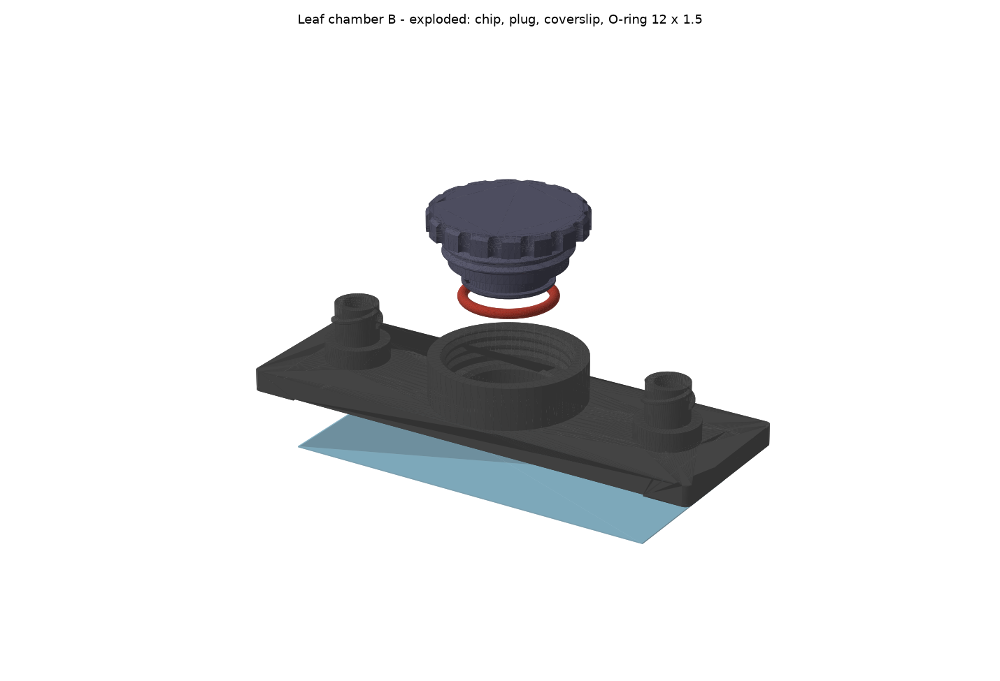
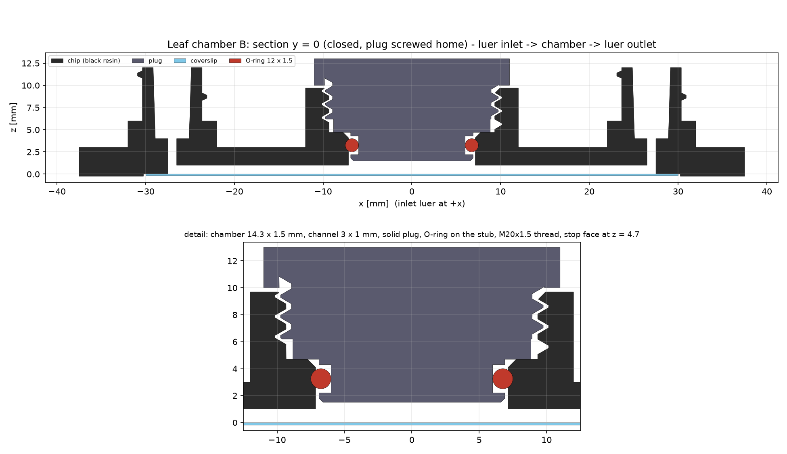

# Leaf chamber chip (slide format, screw-sealed, luer perfusion)

A 75 × 25 mm chip for transmission microscopy of a piece of leaf that is perfused by a pump:
water, H₂O₂ or another solution goes in through a female **luer lock**, flows through the
chamber past the leaf, and leaves into an open **reservoir** (variant A) or a second **luer**
(variant B, the default). The leaf chamber is closed with a **3D-printed screw plug** that carries an
O-ring. The plug is solid by default (`plug_window = 0`); with `plug_window = 1` it gets a glued
glass window and a clear aperture, so the sample sits between two coverslips.





| variant | outlet | chip | assembly |
|---|---|---|---|
| B (default) | luer lock (tubing) | `PRT - 9301 - MFLEAFCHIP - V04 - B` | `ASS - 9300 - MFLEAF - V04 - B` |
| A | open reservoir, 1.5 mL | `PRT - 9301 - MFLEAFCHIP - V04 - A` | `ASS - 9300 - MFLEAF - V04 - A` |

Both use the same plug `PRT - 9302 - MFLEAFPLUG - V04`. The numbers are provisional (9xxx is
unused in openUC2-CAD-new); renumber them in `leaf_chamber.py` (`NUMBERS`).


## Create

```
C:\Users\benir\miniforge3\envs\pyinventor\python.exe build_leaf_chamber.py --variant B --set ch_w=3 --set chamber_h=2.0 --set th_clear=.3 --set stub_clear=.3
C:\Users\benir\miniforge3\envs\pyinventor\python.exe build_leaf_chamber.py --set ch_w=3 --set ch_h=1.0 --set chamber_h=1.5
```

## How it works

- **Optical floor and channel lid in one.** The channels are open grooves on the underside of the
  chip. A 24 × 60 mm #1.5 coverslip is glued into a 0.25 mm deep band under the chip. It closes the
  channels and is also the floor the leaf lies on. Open grooves print crisp on the Form 4 and wash
  out easily; closed SLA channels below about 0.5 mm tend to clog with uncured resin. To get closed
  tunnels instead, set `ch_floor > 0` (see "Variants of the idea").
- **Chamber.** A Ø14.3 well through the slab. The leaf lies on the coverslip, and the chamber is
  `chamber_h` high (0.8 mm by default, about 128 µL). The channels enter the well at floor level,
  so a channel can be at most as deep as the chamber (`ch_floor + ch_h <= chamber_h`).
- **Plug.** The plug is M20 × 1.5 with modelled threads, right-handed. The printing clearance is
  split: `th_clear` (chip bore) and `plug_th_clear` (plug), so the fit can be loosened by reprinting
  only the plug. Its stub reaches into the well:
  - The stub bottom is the **chamber ceiling**. A solid black plug blocks the transmitted light:
    print it in Clear resin, or set `plug_window = 1` for a Ø12 #1.5 round coverslip glued into the
    stub plus a Ø10 aperture.
  - The stub carries the CAD-new **O-ring ISO 3601-1 12 × 1.5**. It forms a static radial seal
    against the well bore: 23 % squeeze, 73 % groove fill.
  - The plug **bottoms out on a stop face** (`ledge_z`). The chamber height therefore does not
    depend on how hard you screw, and the seal does not depend on torque.
  - The head has 16 grip flutes.
- **Ports.** Female luer lock to ISO 80369-7 / ISO 594-2:
  - 6 % taper bore, Ø4.29 at the face, 8 mm deep
  - Ø6.73 hub, two right-hand lugs to Ø7.83 (2-start, 5 mm lead)
  - the hub stays slim for 6 mm below the face for the male collar, on a Ø10 foot

  A Ø1 via connects each port to its channel.

Frame (all parts share it, so the assembly places everything at identity): origin at the chamber
centre on the glue plane, so z = 0 is the top of the bottom coverslip (the leaf plane). The inlet
is at +X, the outlet at −X, and Z points away from the objective (inverted microscope). Overall
height above the coverslip is `plug_top` (12.3 mm by default, 13 mm with `chamber_h = 1.5`) and
12 mm at the luer.

## Build

Needs a running Inventor and the miniforge `pyinventor` env (pywin32):

```bash
cd chips\leaf_chamber
python leaf_chamber.py                          # parameter table + design checks only (no Inventor)
C:\Users\benir\miniforge3\envs\pyinventor\python.exe build_leaf_chamber.py           # variant B (default)
C:\Users\benir\miniforge3\envs\pyinventor\python.exe build_leaf_chamber.py --set ch_w=3 --set ch_h=1.0 --set chamber_h=1.5
C:\Users\benir\miniforge3\envs\pyinventor\python.exe build_leaf_chamber.py --variant all   # A and B
C:\Users\benir\miniforge3\envs\pyinventor\python.exe build_leaf_chamber.py --params my_chip.json --show
```

Outputs go to `INVENTOR/`:
- the parts `.ipt` and the assemblies `.iam`;
- `.stp` files (AP214, with colours);
- `.stl` files of the two printed parts, in mm, at Inventor's "High" resolution (under 5 µm chord error);
- `<chip> - params.json` with every parameter, the check results and the build report.

The builder runs the design checks first and refuses parameters that break the design, for
example an O-ring squeeze outside 15–32 %, ports off the coverslip, a channel the stub would
block, or walls that are too thin. It then runs Inventor's interference analysis on the closed
assembly. The only overlap there is the intended O-ring squeeze, 14.4 mm³ against the well bore.

### Changing dimensions

Every dimension is an **Inventor user parameter** of the part (Manage → fx). The derived ones are
Inventor expressions, such as `th_bore_d = th_d - 1.0825 * th_p + 2 * th_clear`. So you can open
the `.ipt`, change `ch_w`, `well_d`, `in_x`, `th_p`, `luer_lug_rev`, and so on, and the feature
tree follows, threads and luer lugs included. This was tested: 15 parameter sets on chip and plug,
all features healthy.

Keep in mind:
- **Chip and plug are separate files.** Parameters they share (`well_d`, `chamber_h`, `stub_len`,
  `th_*`, `th_len`) must be changed in both. The script does that for you.
- **To bring Inventor edits back into the script:** run
  `build_leaf_chamber.py --variant A --from-ipt "INVENTOR\PRT - 9301 - MFLEAFCHIP - V04 - A.ipt"`.
  It reads the part's base parameters and rebuilds everything consistently.
- **Couplings that the checks watch:**
  - `well_d` with `groove_root_d` and `oring_cs` (squeeze);
  - `ch_floor + ch_h ≤ chamber_h`;
  - the ports must lie at least 2 mm inside the coverslip (`cs_l`).
  - `chamber_h` raises the stop face (`ledge_z = chamber_h + stub_len`) and the boss top
    (`boss_top = ledge_z + th_len`), so the plug geometry stays valid.

The knobs you are most likely to turn:

| parameter | default | |
|---|---|---|
| `ch_w`, `ch_h` | 1.0, 0.5 mm | channel width and depth; `ch_h` at most `chamber_h` |
| `ch_floor` | 0 | 0 = open groove under the coverslip; > 0 = closed tunnel |
| `via_d` | 1.0 mm | vertical via into the ports; up to about 2.5 (taper bottom Ø3.8) for wide channels |
| `well_d`, `chamber_h` | 14.3, 0.8 mm | leaf space; the O-ring seals on `well_d` |
| `oring_id`, `oring_cs` | 12, 1.5 mm | O-ring size; the groove follows `groove_root_d` (about `well_d - 1.55 * oring_cs`) and `groove_w` (about 1.4 × `oring_cs`) |
| `plug_th_clear` | 0.25 mm | plug thread clearance, radial per side; raise it if the plug is tight |
| `th_clear` | 0.15 mm | chip bore thread clearance, radial per side |
| `stub_clear` | 0.25 mm | stub-to-well clearance, radial per side (plug only) |
| `th_d`, `th_p` | 20, 1.5 mm | thread size; a coarser `th_p` allows more clearance |
| `plug_window` | 0 | 1 = glued window `win_d` (12) with aperture `win_ap` (10) |
| `in_x`, `out_x` | 27, 27 (B) / 25 (A) mm | port positions from the chamber centre |
| `cs_l`, `cs_w`, `cs_t`, `cs_recess` | 60, 24, 0.17, 0.25 mm | bottom coverslip and its glue band |
| `res_d`, `res_top` | 16, 9 mm | reservoir (A) |
| `luer_open_d`, `luer_lug_rev` | 4.29 mm, 0.5 | luer fit and lug length |

`python leaf_chamber.py` prints the whole table with comments.

## Verification

`check_leaf_chamber.py` works on the exported STEP files, independently of Inventor. It
samples points in the mesh domain, because Inventor STEPs break OCC booleans. It checks:
- the internal thread, the plug thread and both luer lugs are **right-handed**, so a standard
  male luer locks on;
- the plug ridges sit in the boss grooves when closed (0 of 17,280 samples overlap);
- the fluid path is open from via to via along the channel, and the channel walls are closed;
- the vias and luer bores are open;
- the open channels lie on the coverslip.

It also draws `docs/section_*.png`, `docs/plan_*.png` and `docs/exploded_*.png`.

```bash
uv run --with cadquery --with trimesh --with rtree --with scipy --with shapely --with networkx --with matplotlib python check_leaf_chamber.py
```

## Print (Form 4, Black resin)

- **Chip:** put the glue face (the side with the channels) **up**, away from the platform. That
  keeps the channels and the glue band support-free and sharp, and the supports land on the boss,
  luer and reservoir tops. A 10–15° tilt helps against cupping in the well and reservoir; check
  PreForm's cup warnings. Do not print the glue face flat on the platform: first-layer over-cure
  closes 0.5 mm grooves.
- **Plug:** put the head toward the platform, thread axis vertical. The window recess and O-ring
  groove stay support-free.
- **Fit:** if the plug runs tight, raise `plug_th_clear` (thread) or `stub_clear` (stub in the
  well) and reprint only the plug. If it gets tight only when the O-ring enters the well, it is the
  O-ring squeeze: grease it, or lower the squeeze with a smaller `groove_root_d`. Wash the open channels well, then post-cure fully. Uncured monomer is not good for
  living tissue.

## Assemble and use

1. Glue the 24 × 60 coverslip into the band. Keep the adhesive out of the channels: thin UV glue
   (for example NOA 81) applied away from the grooves, or a double-sided transfer tape with the
   channel cut out. Cure, then check by flushing.
2. With `plug_window = 1` only: glue the Ø12 round coverslip into the stub recess from below.
3. Fit the O-ring on the stub. A trace of silicone grease or water makes screwing smooth.
4. Put the leaf piece (up to about Ø14, at most about 0.6 mm thick for `chamber_h` = 0.8) on the
   bottom coverslip in the well.
5. Screw the plug in by hand until it stops on the stop face.
6. Connect the pump with a male luer lock to the inlet (+X). Variant A fills the reservoir; it can
   also be used the other way round, with the pump pulling liquid from the reservoir.

Bill of materials per chip:
- printed chip and plug (Black resin);
- coverslip 24 × 60 mm #1.5;
- round coverslip Ø12 mm #1.5 (only with `plug_window = 1`);
- O-ring 12 × 1.5 (ISO 3601-1). CAD-new has it in NBR70; for **H₂O₂** use EPDM or FKM in the same
  size, because NBR is attacked by oxidisers;
- adhesive or transfer tape.

## Open points

- **Coverslip size.** "60 × 40 mm" cannot sit under a 25 mm wide slide, so the default is the
  standard **24 × 60**, which covers every open channel and via. A 24 × 40 coverslip only works
  with closed channels: `--set cs_l=40 --set ch_floor=0.3 --set ch_h=0.5 --set chamber_h=1.0`
  passes the checks.
- **Bubbles.** Leaf tissue (catalase) turns H₂O₂ into O₂. Bubbles collect under the flat window, so
  a higher flow rate helps to carry them to the outlet.
- **Luer lugs.** The printed lugs are 0.55 mm high, as in ISO. If they wear out, a glue-in
  commercial female luer would be a small new variant.
- **Microscope clearance.** Check the 12.3 mm build height against the condenser or LED.

Sources for the luer dimensions: [ISO 594-2 summary (Uni Bremen)](https://www.sedgeochem.uni-bremen.de/luer%20connector.html),
lug and opening tolerances as cited in [US patent 11235134](https://image-ppubs.uspto.gov/dirsearch-public/print/downloadPdf/11235134).
